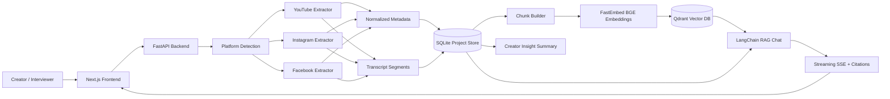
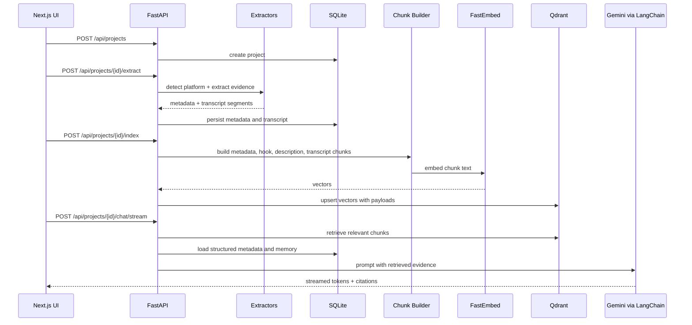
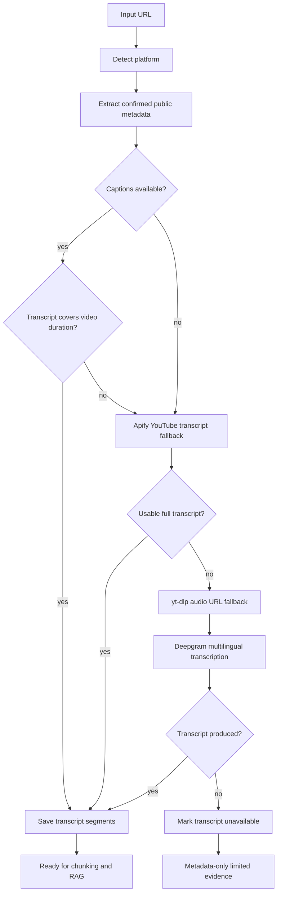
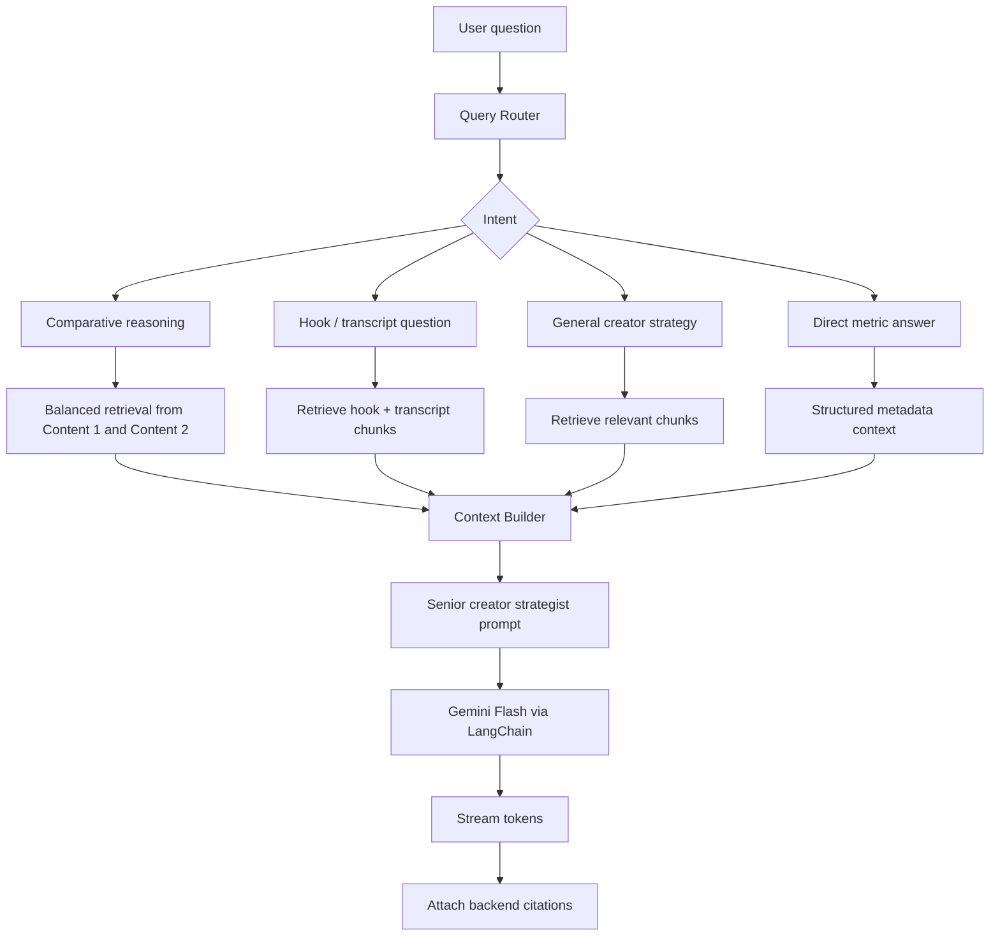
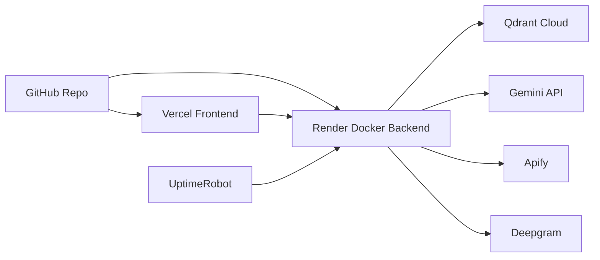

# CreatorLens AI

CreatorLens AI is a full-stack RAG creator intelligence application that compares two public short-form content URLs and turns confirmed metadata, transcript evidence, vector retrieval, and streaming AI chat into actionable creator insights.

The product is built for a technical screening challenge where every output must be dynamic, evidence-backed, and defensible. Users provide two URLs, CreatorLens AI extracts public video evidence, computes engagement metrics, builds a cited vector evidence index, and lets creators ask comparative questions through a streaming RAG chat interface.

```text
Content URL 1 + Content URL 2
        -> platform detection
        -> metadata + transcript extraction
        -> transcript completeness checks
        -> chunking + embeddings
        -> Qdrant vector index
        -> Creator Insight Summary
        -> streaming cited RAG chat
```

## Live Demo

| Surface | URL |
| --- | --- |
| Frontend | https://creator-lens-ai.vercel.app/ |
| Backend | https://creatorlens-ai.onrender.com |
| API docs | https://creatorlens-ai.onrender.com/docs |
| Health | https://creatorlens-ai.onrender.com/health |

## What This Project Proves

| Requirement | Implementation |
| --- | --- |
| Full-stack app | Next.js frontend + FastAPI backend |
| RAG chatbot | LangChain chat flow with retrieval context and memory |
| Embeddings | FastEmbed with `BAAI/bge-small-en-v1.5` |
| Vector DB | Qdrant Cloud with chunk payload filters |
| Streaming responses | Server-sent events from FastAPI to the chat UI |
| Citations | Backend-generated citations for metadata, hook, transcript, and description chunks |
| Two video comparison | Universal Content 1 / Content 2 workflow |
| Dynamic outputs | Extracted from live/public evidence, not hard-coded |
| Metadata extraction | Views, likes/reactions, comments, creator, follower/subscriber count, hashtags, upload date, duration when publicly available |
| Engagement rate | `(likes + comments) / views * 100` for YouTube/Instagram-style metrics; platform-specific interaction handling for Facebook |
| Transcript extraction | YouTube captions, Apify fallback, yt-dlp audio fallback, Deepgram multilingual transcription where applicable |
| Evidence quality | Missing metrics remain unavailable and are not estimated |

## Supported Inputs

| Platform | Supported URL types | Evidence strategy |
| --- | --- | --- |
| YouTube | Shorts, public watch URLs, `youtu.be` URLs | YouTube Data API metadata, captions, Apify transcript fallback, yt-dlp audio fallback |
| Instagram | Reels, posts, TV URLs | Public extraction and Deepgram transcription when public audio is available |
| Facebook | Reels, watch URLs, public post video URLs | Public extraction and Deepgram transcription when public audio is available |

Supported comparisons:

- YouTube vs YouTube
- YouTube vs Instagram
- YouTube vs Facebook
- Instagram vs Instagram
- Instagram vs Facebook
- Facebook vs Facebook

## Tech Stack

| Layer | Technology | Reason |
| --- | --- | --- |
| Frontend | Next.js, React, TypeScript | Fast full-stack UI, App Router, deploys cleanly on Vercel |
| Backend | FastAPI, Python | Strong API ergonomics, async streaming, clean service boundaries |
| RAG orchestration | LangChain | Required by challenge and useful for model abstraction |
| LLM | Gemini Flash through `langchain-google-genai` | Low-cost streaming reasoning for demo scale |
| Embeddings | FastEmbed `BAAI/bge-small-en-v1.5` | Open-source, local embedding generation, avoids per-token embedding cost |
| Vector DB | Qdrant Cloud | Payload filtering by project, slot, platform, and source type |
| Storage | SQLite | Lightweight demo persistence; production path is Postgres |
| Transcript fallback | `youtube-transcript-api`, Apify, yt-dlp, Deepgram | Layered extraction because social platforms are unreliable from cloud IPs |
| Deployment | Vercel + Render Docker + UptimeRobot | Simple free-tier deployment with external backend keep-alive monitoring |

## High-Level Architecture



## Low-Level Backend Flow



## Extraction Pipeline

CreatorLens AI treats extraction as an engineering problem, not a single API call. Public social platforms are inconsistent, and cloud IPs can be blocked by transcript endpoints. The pipeline is deliberately layered.



Transcript completeness is checked against known duration. A short partial transcript is not accepted as final when a better fallback can be attempted.

## Evidence Index Design

CreatorLens AI does not send raw pages directly to the LLM. It builds a retrieval-ready evidence index.

| Source type | Built from | Why it matters |
| --- | --- | --- |
| `metadata` | creator, views, likes, comments, duration, upload date, transcript source, missing fields | Answers factual metric questions without hallucination |
| `description` | YouTube descriptions, Instagram/Facebook captions | Captures creator framing and CTA language |
| `hook` | first timed transcript segments or first caption sentence | Supports first-5-seconds hook comparison |
| `transcript` | transcript segments grouped into chunks | Supports deeper RAG reasoning and citations |

Each chunk stores:

| Payload field | Purpose |
| --- | --- |
| `project_id` | Multi-project isolation |
| `slot` | `content_1` or `content_2` |
| `platform` | YouTube, Instagram, or Facebook |
| `source_type` | metadata, description, hook, transcript |
| `start_time`, `end_time` | Timed citations when available |
| `title`, `creator` | Better citation context |
| `text` | Evidence content |
| `content_hash` | Stable dedupe/debug identity |
| `citation_label` | Human-readable citation in chat |

## RAG Chat Architecture



The chat supports questions such as:

- What is the engagement rate of each content item?
- Compare the hooks in the first 5 seconds.
- Why did Content 1 get more engagement than Content 2?
- Who is the creator of Content 2 and what public follower/subscriber count is available?
- Suggest 3 improvements for Content 2 based on what worked in Content 1.

For comparative reasoning, retrieval is balanced across both content items so the answer does not overfit to whichever chunk ranked first.

## Creator Insight Summary

The Creator Insight Summary is deterministic. It does not call the LLM, and it does not claim to predict virality. It produces fast, explainable creator review signals from extracted evidence.

| Signal | Meaning | Inputs |
| --- | --- | --- |
| Public performance score | How strongly the content performed using confirmed metrics | views, interactions, engagement rate |
| Creator efficiency score | How much the content overperformed relative to creator size | views/subscribers, interactions/subscribers |
| Creative structure score | How clear the content structure appears | hook, caption, CTA, audience specificity, problem-solution framing |
| Evidence confidence | How much confirmed evidence is available | metadata completeness and metric availability |

Overall Creator Insight Score combines:

```text
35% public performance
30% creator-size efficiency
25% creative structure
10% metric confidence
```

This separation is intentional. Metadata availability is useful for confidence, but it is not treated as a creative strength. A smaller creator with far more views and likes can correctly win on creator efficiency even if another content item has a more explicit hook.

## Data Integrity Rules

CreatorLens AI follows strict evidence rules:

- Missing views, likes, comments, duration, follower counts, and transcript evidence are not estimated.
- Unavailable fields stay unavailable in the UI and RAG context.
- LLM responses are instructed not to invent metrics.
- Metadata availability supports confidence only; it is not a performance score.
- Scores are heuristic review signals, not guaranteed performance predictions.
- Citations are generated from backend evidence chunks, not from frontend decoration.

## Backend Modules

| Area | Files |
| --- | --- |
| API routes | `backend/app/api/projects.py`, `chat.py`, `insights.py`, `metrics.py`, `health.py` |
| Extraction | `backend/app/extractors/youtube_extractor.py`, `instagram_extractor.py`, `facebook_extractor.py` |
| Transcript fallbacks | `backend/app/services/apify_transcript_service.py`, `transcription_service.py` |
| RAG | `backend/app/rag/chunk_builder.py`, `indexing_service.py`, `retrieval_service.py`, `context_builder.py`, `query_router.py`, `chat_service.py` |
| Insight scoring | `backend/app/insights/insight_service.py`, `score_service.py`, `hook_analyzer.py` |
| Persistence | `backend/app/services/storage_service.py`, `chat_memory_service.py` |
| Config | `backend/app/core/config.py`, `paths.py` |

## Frontend Modules

| Area | Files |
| --- | --- |
| App routes | `frontend/src/app/page.tsx`, `analyze/page.tsx`, `chat/page.tsx` |
| Main workflow | `frontend/src/components/ComparisonWorkspace.tsx` |
| Chat | `frontend/src/components/CreatorChatPanel.tsx`, `CreatorChatPage.tsx` |
| Insights | `CreatorInsightSummaryPanel.tsx`, `InsightScoreCard.tsx`, `HookComparisonCard.tsx` |
| Evidence tools | `RagIndexPanel.tsx`, `RetrievalTestPanel.tsx`, `TranscriptPreviewPanel.tsx` |
| API client | `frontend/src/lib/api.ts` |
| Types | `frontend/src/types/project.ts` |

## API Surface

| Endpoint | Purpose |
| --- | --- |
| `GET /health` | Backend health |
| `GET /health/qdrant` | Vector DB configuration/connectivity |
| `GET /health/embeddings` | Embedding model readiness |
| `GET /health/llm` | LLM config check without generation |
| `POST /health/llm/test` | Real LLM generation test |
| `POST /api/projects` | Create comparison project |
| `POST /api/projects/{project_id}/extract` | Extract metadata and transcripts |
| `GET /api/projects/{project_id}` | Load project detail |
| `GET /api/projects/{project_id}/transcripts` | Transcript preview |
| `GET /api/projects/{project_id}/metadata-availability` | Availability report |
| `POST /api/projects/{project_id}/chunks/build` | Build local evidence chunks |
| `POST /api/projects/{project_id}/index` | Embed and index chunks in Qdrant |
| `POST /api/projects/{project_id}/retrieve` | Inspect retrieval results |
| `GET /api/projects/{project_id}/insights/summary` | Deterministic creator insight summary |
| `POST /api/projects/{project_id}/chat/stream` | Streaming RAG chat |

## Local Setup

### Backend

```powershell
cd backend
python -m venv .venv
.\.venv\Scripts\activate
pip install -r requirements.txt
copy .env.example .env
python -m uvicorn app.main:app --reload --host 0.0.0.0 --port 8000
```

### Frontend

```powershell
cd frontend
npm install
npm run dev
```

Local URLs:

| Service | URL |
| --- | --- |
| Frontend | http://localhost:3000 |
| Analyze | http://localhost:3000/analyze |
| Chat | http://localhost:3000/chat |
| Backend health | http://localhost:8000/health |
| API docs | http://localhost:8000/docs |

## Environment Variables

### Backend

| Variable | Required | Purpose |
| --- | --- | --- |
| `ENVIRONMENT` | yes | `local` or `production` |
| `CORS_ORIGINS` | yes | Allowed frontend origins |
| `GEMINI_API_KEY` | yes | Gemini chat and reasoning |
| `LLM_PROVIDER` | yes | `gemini` |
| `LLM_MODEL` | yes | Primary Gemini model |
| `LLM_FALLBACK_MODEL` | optional | Fallback Gemini model |
| `QDRANT_URL` | yes | Qdrant Cloud endpoint |
| `QDRANT_API_KEY` | yes | Qdrant API key |
| `QDRANT_COLLECTION` | yes | Vector collection name |
| `EMBEDDING_MODEL_NAME` | yes | FastEmbed model name |
| `YOUTUBE_API_KEY` | recommended | YouTube Data API metadata |
| `APIFY_API_TOKEN` | recommended | YouTube transcript fallback |
| `APIFY_YOUTUBE_TRANSCRIPT_ACTOR` | recommended | Configurable Apify transcript actor |
| `DEEPGRAM_API_KEY` | recommended | Audio transcription fallback |
| `TRANSCRIPT_LANGUAGE` | yes | `multi` for language detection |
| `TRANSCRIPT_FALLBACK_LANGUAGES` | yes | Caption language priority |

### Frontend

| Variable | Required | Purpose |
| --- | --- | --- |
| `NEXT_PUBLIC_API_BASE_URL` | yes | Public backend API base URL |

## Deployment



| Component | Platform | Notes |
| --- | --- | --- |
| Frontend | Vercel | Root directory: `frontend` |
| Backend | Render | Docker build from `backend/Dockerfile` |
| Keep-alive monitor | UptimeRobot | Polls backend health endpoint to reduce Render free-tier cold starts |
| Vector DB | Qdrant Cloud | Stores evidence chunks and payload metadata |
| LLM | Gemini API | Streaming RAG responses |
| Transcript fallback | Apify + Deepgram | Used only when cheaper/free paths are insufficient |

Render production reminders:

```text
ENVIRONMENT=production
CORS_ORIGINS=https://creator-lens-ai.vercel.app/,http://localhost:3000
NEXT_PUBLIC_API_BASE_URL=https://creatorlens-ai.onrender.com
```

UptimeRobot monitor:

| Setting | Value |
| --- | --- |
| Monitor type | HTTP(s) |
| URL | `https://creatorlens-ai.onrender.com/health` |
| Expected method/result | `GET` request returning HTTP `200` with `{"status":"ok"}` |
| Interval | 5 minutes |
| Purpose | Keep the Render backend warm for demos and alert if the public API becomes unavailable |

If UptimeRobot reports `405`, verify the monitor uses the full HTTPS URL above and targets `/health`, not a POST-only API route. The backend health endpoint is intentionally cheap and does not call Gemini, Qdrant, Apify, or Deepgram.

## Cost and Scale Strategy

The lowest-cost architecture is to avoid unnecessary LLM and paid transcription calls.

| Cost driver | Current strategy | Production upgrade |
| --- | --- | --- |
| Embeddings | FastEmbed local BGE model, no embedding API cost | Batch embedding workers |
| LLM calls | Only chat/reasoning uses Gemini | Cache common questions and summaries |
| Transcript extraction | Free captions first, Apify/Deepgram only as fallback | URL-level transcript cache and retry queue |
| Vector storage | Qdrant payload filters per project/slot | Payload indexes, collection sharding if needed |
| Database | SQLite for demo | Postgres with project/session tables |
| Backend work | Synchronous demo flow | Background jobs with Redis/RQ/Celery |
| Cold starts | UptimeRobot health monitor for Render | Paid always-on instance or autoscaled worker/API split |

For 1000 creators/day:

- Cache metadata, transcripts, chunks, and embeddings by normalized URL and content hash.
- Do not re-embed unchanged content.
- Use background jobs for extraction and indexing.
- Keep deterministic metric and scoring logic outside the LLM.
- Use paid transcript fallback only when direct captions are blocked or incomplete.
- Add observability around extraction failures, transcript coverage, Qdrant indexing, and LLM latency.
- Keep the public backend warm during demos with UptimeRobot, while using a paid always-on backend for serious production traffic.

## Quality Trade-Offs

| Decision | Why |
| --- | --- |
| FastEmbed BGE instead of paid embeddings | Lower recurring cost and strong retrieval quality for short evidence chunks |
| Qdrant instead of local-only vector DB | Production-style vector service with payload filtering |
| Gemini Flash instead of heavier model by default | Good reasoning/cost balance for streamed creator chat |
| Deterministic insight scoring | Fast, explainable, and does not hallucinate metrics |
| Layered transcript fallback | Social transcript extraction is unreliable from cloud IPs |
| SQLite for demo | Keeps deployment simple; Postgres is the production path |

## Validation Commands

```powershell
cd backend
python -m compileall app
```

```powershell
cd frontend
npm run build
```

Health checks:

```text
GET /health
GET /health/qdrant
GET /health/embeddings
GET /health/llm
POST /health/llm/test
```

## Demo Script Summary

1. Open the live frontend.
2. Paste Content 1 and Content 2 URLs.
3. Run analysis.
4. Verify metadata, engagement rate, missing fields, transcript source, and transcript segment count.
5. Build/index evidence.
6. Show Creator Insight Summary.
7. Ask the RAG chat:
   - What is the engagement rate of each content item?
   - Compare the hooks in the first 5 seconds.
   - Why did Content 1 get more engagement than Content 2?
   - Suggest 3 improvements for Content 2 based on what worked in Content 1.
8. Point out streaming, citations, memory, and evidence limitations.


## Engineering Principle

CreatorLens AI is designed around one rule: do not pretend unavailable evidence exists. The system can be creative in its recommendations, but the factual base must come from confirmed public metadata, transcript chunks, and cited retrieval evidence.
